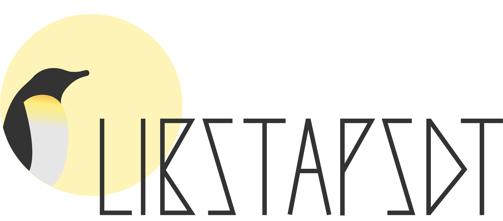

<p align="left">
  <a href="https://github.com/sthima/libstapsdt">
    
  </a>
</p>


[](https://github.com/sthima/libstapsdt)
[](https://travis-ci.org/sthima/libstapsdt)
[](https://libstapsdt.readthedocs.org/)

-------------------------------------------------------------------------------

`libstapsdt` is a library which allows creating and firing Systemtap's USDT
probes at runtime. It's inspired on
[chrisa/libusdt](https://github.com/chrisa/libusdt/). The goal of this
library is to add USDT probes functionality to dynamic languages.

## Table of Contents

<!-- TOC depthFrom:2 depthTo:6 withLinks:1 updateOnSave:1 orderedList:0 -->

- [Table of Contents](#table-of-contents)
- [How it works](#how-it-works)
- [Dependencies](#dependencies)
	- [Ubuntu 16.04](#ubuntu-1604)
- [Install](#install)
- [Demo](#demo)
- [Run tests](#run-tests)
- [Write your own wrapper](#write-your-own-wrapper)

<!-- /TOC -->

## How it works

Systemtap's USDT implementation allows only statically defined probes because
they are set as ELF notes by the compiler. To create probes at runtime,
`libstapsdt` takes advantage of shared libraries: it creates a small library
with an ELF note and links it at runtime. This way, most existing tools will
keep working as expected.

## Dependencies

`libstapsdt` currently requires the following dependencies:

* libelf (from elfutils)

### Ubuntu 16.04

```bash
sudo apt install libelf1 libelf-dev
```

### Fedora 29

```bash
sudo dnf install elfutils-libelf-devel
```

## Install

To build and install libstapsdt, just run:

```bash
make
sudo make install
sudo ldconfig
```

## Demo

There's a demo program available. To build it, run:

```bash
make demo  # Executable will be available at ./demo
```

Usage:

```bash
./demo PROVIDER_NAME PROBE_NAME
```

After running the demo program, it can be instrumented with proper tools.

Here's an example using [eBPF/bcc](https://github.com/iovisor/bcc) trace tool
(built from source):

```bash
sudo /usr/share/bcc/tools/trace -p $(pgrep demo) 'u::PROBE_NAME'
```

## Run tests

To run tests, just run the command below. Please be aware that there are only
a few tests for now, but more will be added in the future.

```bash
make test
```

# Wrappers

Here is a list of wrappers for other languages:

  * [Python](https://pypi.org/project/stapsdt/)
  * [NodeJS](https://www.npmjs.com/package/usdt)
  * [Go](https://github.com/mmcshane/salp)

## Write your own wrapper

`libstapsdt` is written in C, which makes it very portable to almost any
language. Most dynamic languages provide a way to wrap C code. Feel free to
develop a wrapper in your language of choice. If you do, please let us know to
update our wrappers list!
