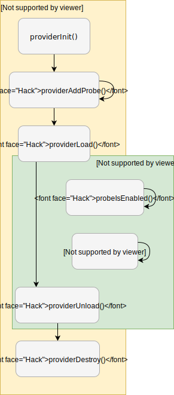

####################
libstapsdt explained
####################

``libstapsdt`` has a small API with only 7 functions and one possible flow. To
use ``libstapsdt`` you need to create a provider and register probes to it. A
provider has two possible states: unloaded and loaded. After creating it, it's
state is unloaded. After all probes are registered, you need to load your
provider, effectively allowing tracing tools to access the provider's probes.

After you finish using those probes, you can unload the provider, freeing all
structures allocated to it during the load step. Only after that you can
destroy the provider, removing all registered probes with it.

This flow is illustrated in the image below:

=======
Example
=======

The following example goes through all steps of ``libstapsdt``'s flow:

.. code-block:: c

  #include <unistd.h>
  #include <stdio.h>
  #include <libstapsdt.h>

  int main() {
    int i=1;
    SDTProvider_t *provider;
    SDTProbe_t *probe;

    provider = providerInit("myLittleProvider");
    probe = providerAddProbe(provider, "myLittleProbe", 1, uint64);

    if(providerLoad(provider) == -1) {
      printf("Something went wrong...\n");
      return -1;
    }

    while(i) {
      printf("Firing probe...\n");
      if(probeIsEnabled(probe)) {
        probeFire(probes[idx], i++, j--);
        printf("Probe fired!\n");
        i = 0;
      }
      sleep(1);
    }

    providerUnload(provider);
    providerDestroy(provider);

    return 0;
  }

Let's take a better look at the code. The first lines are used to create a
provider named ``"myLittleProvider"`` (using :c:func:`providerInit`) and then
it registers a probe named ``"myLittleProbe"`` (using
:c:func:`providerAddProbe`). You may have noticed those extra arguments to
:c:func:`providerAddProbe`: they are used to determine how many arguments
the probe will accept when fired, and the type of those parameters (you can
see all available types in :c:type:`SDTArgTypes_t`).

.. code-block:: c

  SDTProvider_t *provider;
  SDTProbe_t *probe;

  provider = providerInit("myLittleProvider");
  probe = providerAddProbe(provider, "myLittleProbe", 1, uint64);

After creating our provider and registering our probe, we need to load our
provider (otherwise we won't be able to fire our probes). This is done by
simply calling :c:func:`providerLoad` with the provider as argument. It's
important to handle any errors that may occur to avoid problems in execution
later on.

.. code-block:: c

  if(providerLoad(provider) == -1) {
    printf("Something went wrong...\n");
    return -1;
  }

Now we can use :c:func:`probeIsEnabled` and :c:func:`probeFire`.
:c:func:`probeIsEnabled` will only return `True` if the program is being
traced. Therefore, in this example we'll be on an infinite loop until our
program is traced. You can use
`iovisor/bcc <https://github.com/iovisor/bcc/>`_ ``trace`` tool for this
(``sudo /usr/share/bcc/tools/trace -p PID 'u::myLittleProbe'``).

After using the trace tool, our probe will be replaced by a breakpoint, and
:c:func:`probeIsEnabled` will return ``True``, firing the probe with
:c:func:`probeFire` inside our if-statement and then stepping out of our loop.

.. code-block:: c

  while(i) {
    printf("Firing probe...\n");
    if(probeIsEnabled(probe)) {
      probeFire(probe, "I'm a runner!");
      printf("Probe fired!\n");
      i = 0;
    }
    sleep(1);
  }

Those last lines of code are used to unload and cleanup our provider. It is
imporant that you run both :c:func:`providerUnload` and
:c:func:`providerDestroy` in this exact order after you don't need the probes
anymore, to avoid memory leaks and Segmentation faults.

.. code-block:: c

  providerUnload(provider);
  providerDestroy(provider);
